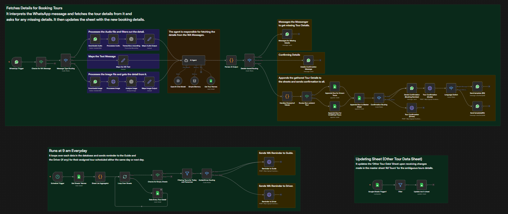

# WhatsApp Tour Booking Automation (n8n)

An AI-powered automation workflow built in n8n that enables internal team to book tours and services directly through WhatsApp using natural language, with automated confirmations, sheet updates, and scheduled reminders.

---

## 📌 Overview

This project connects WhatsApp, OpenAI, and Google Sheets to build a conversational tour booking assistant.

Users can send messages like:

Book Panda House Tour tomorrow at 4pm for 2 adults and 1 kid  
Schedule kayaking on 8 December at 9 am  
Need a city tour next Monday for 5 people with pickup  
Book desert safari for tonight  

The workflow processes the message, extracts structured booking details using AI, validates the data, updates Google Sheets, and sends confirmations and reminders automatically.

---

## 🏗️ Workflow Architecture

### Main Components

- WhatsApp Trigger  
- Message Type Routing (Text / Audio / Image handling)  
- Audio Download & Transcription  
- Image Processing & AI Extraction  
- AI Agent (intent detection + booking extraction)  
- Confirmation Handling  
- Google Sheets Nodes:
  - Append New Booking  
  - Update Master Tour Sheet  
  - Update Other Tour Data Sheet  
- Code Nodes (PAX normalization + multi-recipient routing)  
- WhatsApp Send Message (confirmation & reminders)  
- Schedule Trigger (Daily reminder workflow)

---

## 🔄 Workflow Visual

---

## 🧠 How It Works

### 1. User Input (WhatsApp)

- Accepts text messages  
- Accepts audio messages (automatically transcribed)  
- Accepts image messages (AI extracts booking details)

### 2. AI Processing

The AI Agent:
- Detects booking intent
- Extracts:
  - Service / Tour Name
  - Date and Time
  - Adult Count
  - Kids Count
  - PAX
  - Pricing details
  - Additional services
  - Driver requirement
- Converts relative dates (e.g., “tomorrow”, “next Monday”)
- Standardizes tour names using Google Sheet lookup
- Handles missing details through follow-up interaction
- Sends confirmation preview before finalizing booking

### 3. Booking Confirmation Flow

- Sends structured booking preview  
- Waits for user confirmation  
- On confirmation:
  - Appends booking to sheet  
  - Sends confirmation messages  
  - Routes notifications to admin and driver (if required)

### 4. Google Sheets Integration

The workflow:
- Appends confirmed bookings to Master Sheet  
- Updates Known Tour Sheet  
- Handles ambiguous tour cases separately  
- Syncs updates across related sheets  

### 5. Reminder Automation (Runs Daily at 9 AM)

- Fetches all bookings from sheet  
- Filters tours scheduled for:
  - Same day  
  - Next day  
- Sends WhatsApp reminders to:
  - Guide  
  - Driver (if driver_required = Yes)

---

## 🛠️ Tech Stack

- n8n (Workflow Automation)  
- WhatsApp API  
- OpenAI (Chat Model + Audio/Image Processing)  
- Google Sheets API  
- JavaScript (Code Nodes for normalization & routing)

---

## 🔐 Required Credentials

To run this workflow, configure the following in n8n:

- WhatsApp API Credentials  
- OpenAI API Key  
- Google Sheets OAuth2 Credentials with Sheets scope

---

## ✅ Features

- Natural language tour booking  
- Audio message support  
- Image-based detail extraction  
- Multi-turn conversational handling  
- Tour name fuzzy matching  
- Confirmation-before-finalization logic  
- Automatic PAX calculation  
- NA → 0 numeric normalization  
- Multi-recipient message routing  
- Driver conditional notifications  
- Daily automated reminders  
- Google Sheets-based booking management  

---

## 🎯 Use Cases

- Tour operators  
- Travel agencies  
- Activity booking services  
- WhatsApp-based booking systems  
- AI-powered automation portfolio project  

---
